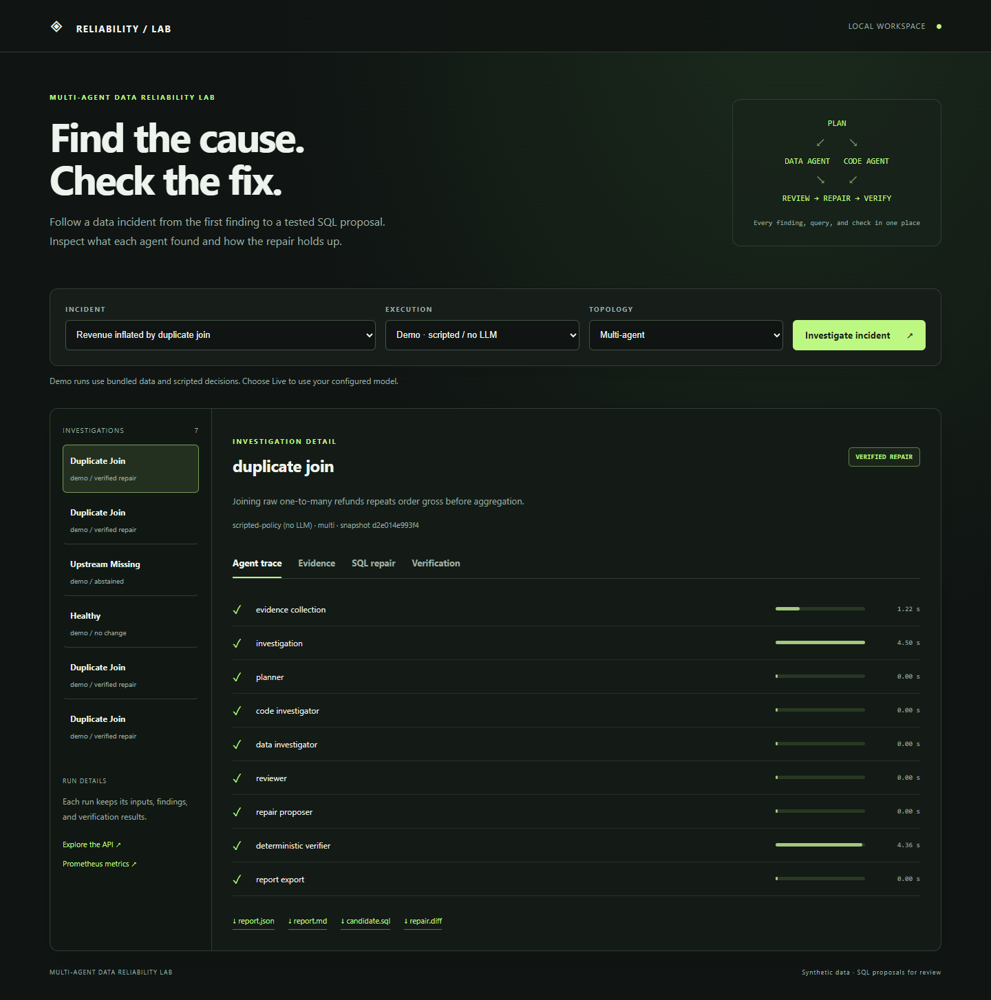
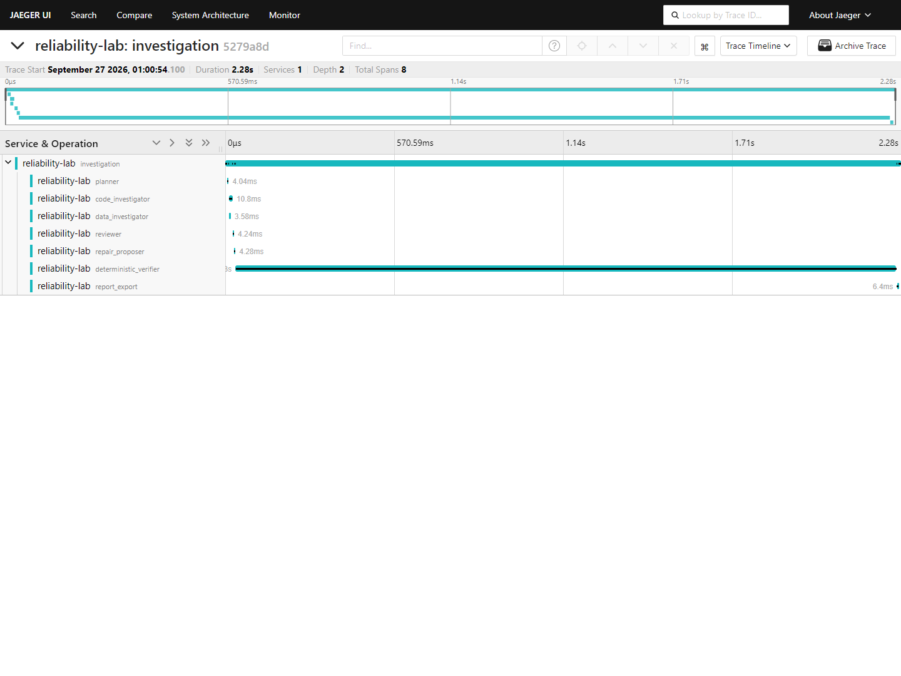
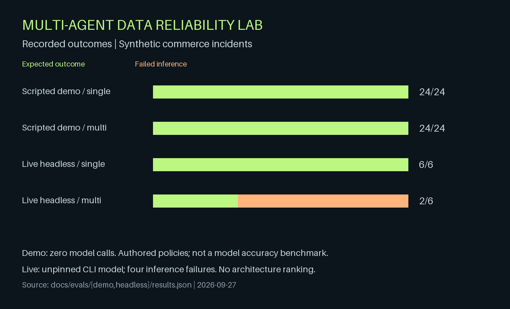
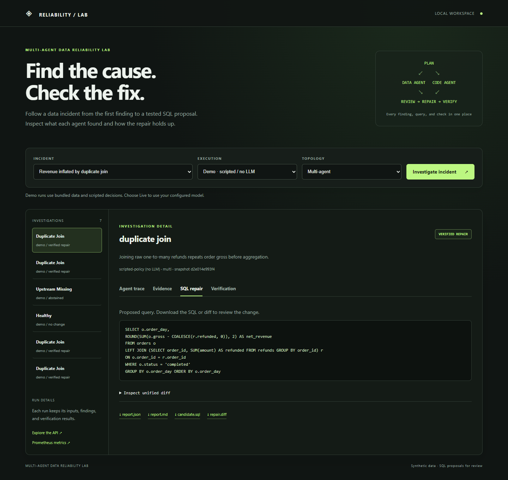
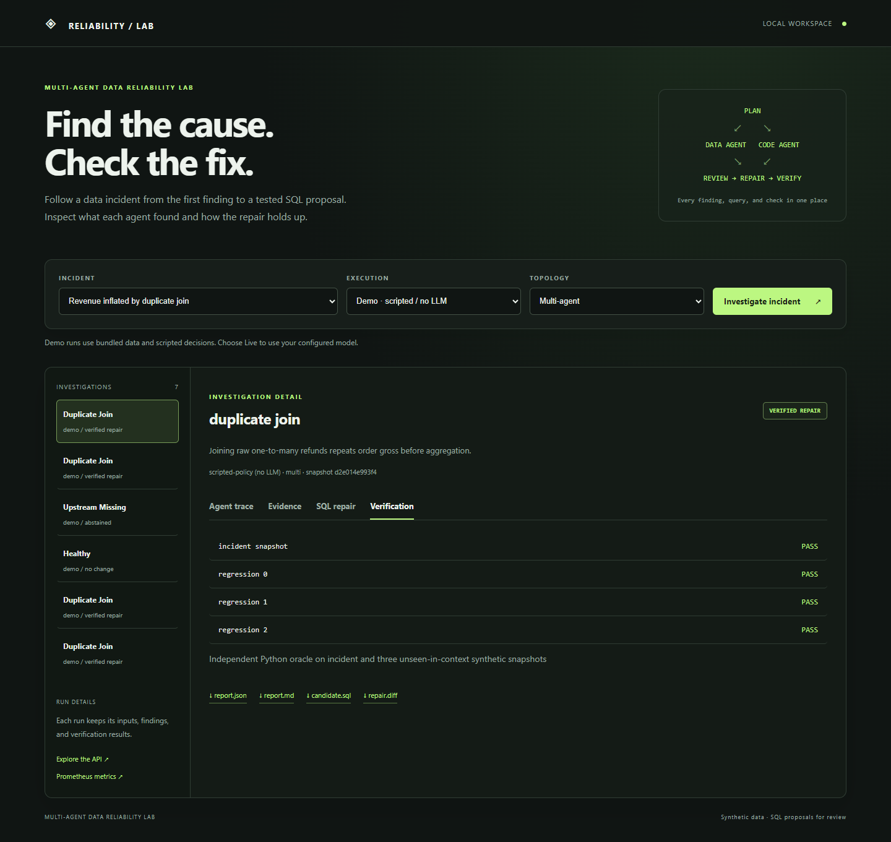
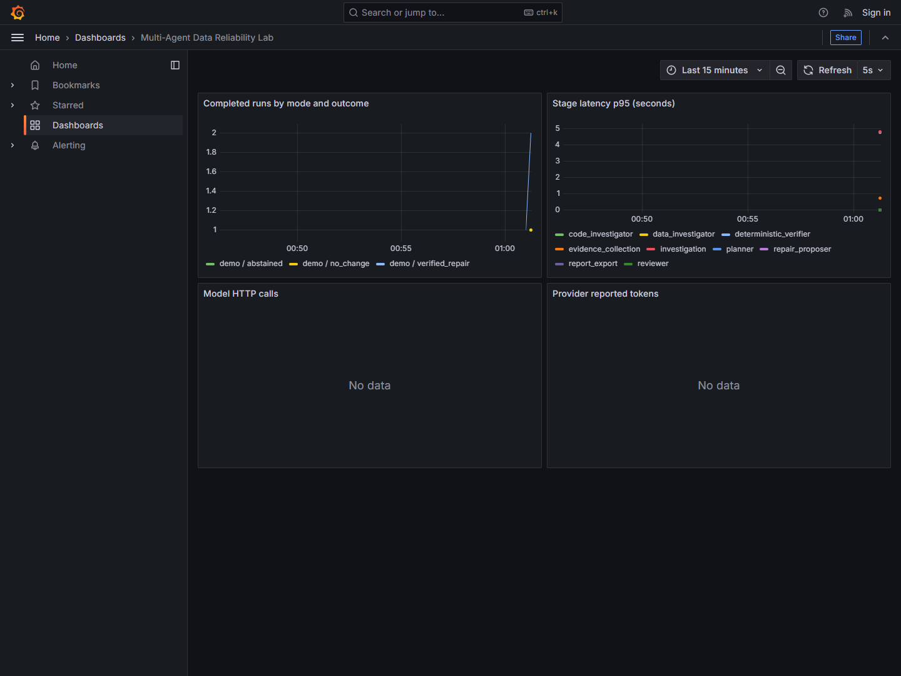

<div align="center">

# Multi-Agent Data Reliability Lab

### **Find the bad join. Explain the broken metric. Test the fix.**

A local workspace for investigating SQL data incidents with cooperating agents.

[](https://github.com/giridhar1103/multi-agent-data-reliability-lab/actions/workflows/ci.yml)


[](LICENSE)

[**Quick start**](#quick-start) · [**Architecture**](#architecture) · [**Results**](#evaluation-results) · [**Documentation**](#documentation)

</div>



## **Why this exists**

A revenue query can run successfully and still return the wrong number. Join orders to a refunds table, and an order with two refunds can count twice. The dashboard looks plausible. The pipeline stays green.

This project follows that kind of incident from diagnosis to a tested SQL proposal. Data and code investigators examine the same incident from different angles, a reviewer checks their findings, and a separate verifier tests the proposed query. Every run leaves a trace, an evidence bundle, and a report you can inspect.

**The current dataset is synthetic commerce data.** Six bundled scenarios cover broken joins, refund signs, cancelled orders, healthy pipelines, missing records, and missing metric definitions. The app exports repairs for review; it does not apply them to a warehouse.

## **Quick start**

You need Docker with Linux containers. The demo runs without an API key.

```sh
git clone https://github.com/giridhar1103/multi-agent-data-reliability-lab.git
cd multi-agent-data-reliability-lab
docker compose up --build -d --wait
```

Open **[localhost:8000](http://localhost:8000)** and click **Investigate incident**. Start with the duplicate-join scenario, then inspect the agent trace, proposed SQL, and verification checks.

| Try this | What to look for |
|---|---|
| **Duplicate join** | A repair that aggregates refunds before joining orders |
| **Healthy pipeline** | A no-change decision |
| **Missing upstream records** | Abstention when a SQL rewrite cannot recover lost data |
| **Ambiguous metric contract** | Abstention when the definition of revenue is missing |

If port 8000 is busy, set `LAB_PORT=8001` in `.env`. Run data survives container restarts in a named volume.

<details>
<summary><strong>CLI commands</strong></summary>

```sh
# Investigate one incident
docker compose exec lab reliability-lab run --scenario duplicate_join

# Run the evaluation suite
docker compose exec lab reliability-lab eval --output /data/evals

# Stop the stack; keep saved runs
docker compose down
```

</details>

## **Architecture**


**Plan → investigate in parallel → review → propose → verify.** The reviewer can also choose no change or abstain. A candidate must match an independent Python calculation on the incident snapshot and three additional regression snapshots.

| Layer | Responsibility |
|---|---|
| **LangGraph** | Separate agent contexts, parallel investigation, conditional routing, checkpoints |
| **Pydantic** | Structured responses and validation of evidence references |
| **Model adapter** | Configurable inference, bounded retries, call budgets, cached responses |
| **DuckDB + SQLGlot** | Restricted SELECT queries, process deadlines, row and memory limits |
| **Verification** | Expected values calculated independently of the candidate SQL |
| **SQLite** | Run queue, restart recovery, idempotency, persisted events |
| **FastAPI + CLI** | Investigation workspace and downloadable JSON, Markdown, SQL, and diffs |
| **OpenTelemetry + Prometheus** | Stage traces, outcome counters, latency, model usage |

[Read the architecture notes →](docs/architecture.md)

## **Use your own model**

Copy `.env.example` to `.env` and configure a Chat Completions-compatible endpoint:

```dotenv
LAB_MODEL_BASE_URL=https://your-provider.example/v1
LAB_MODEL=your-model-id
LAB_API_KEY=your-key
LAB_MAX_MODEL_CALLS=8
LAB_MAX_OUTPUT_TOKENS=1200
```

Run `docker compose up -d`, then select **Live** in the interface.

**For Ollama**, use `http://host.docker.internal:11434/v1`, an installed model ID, and an empty API key. The model must support the adapter's JSON response format. Credentials stay on the server; incident context is sent to the endpoint you configure.

**Demo mode** uses scripted policies. **Live mode** calls the configured model and reports provider failures without falling back to demo results. An optional host CLI transport is covered in the [evaluation guide](docs/evaluation.md#live-inference).

## **Observability**

Add the trace endpoint to `.env`, then start the observability profile:

```dotenv
OTEL_EXPORTER_OTLP_TRACES_ENDPOINT=http://jaeger:4318/v1/traces
```

```sh
docker compose --profile observability up -d --wait
```

| Service | Address | What it shows |
|---|---|---|
| **Application** | [localhost:8000](http://localhost:8000) | Investigations, evidence, SQL, checks |
| **API docs** | [localhost:8000/docs](http://localhost:8000/docs) | Run, resume, and artifact endpoints |
| **Jaeger** | [localhost:16686](http://localhost:16686) | Agent spans and execution timing |
| **Prometheus** | [localhost:9090](http://localhost:9090) | Run outcomes and usage metrics |
| **Grafana** | [localhost:3000](http://localhost:3000) | Provisioned metrics dashboard |



All services bind to localhost. Grafana allows anonymous viewing in this profile. Jaeger traces are temporary; application events persist. See [operating boundaries](SECURITY.md) before changing network access.

## **Evaluation results**

The suite compares single-agent and multi-agent runs across the same six incident families. It records diagnosis, outcome, repair checks, failures, duration, calls, and reported token usage.

| Recorded run | Single-agent | Multi-agent | Interpretation |
|---|---:|---:|---|
| **Scripted demo** | 24/24 expected outcomes | 24/24 expected outcomes | Integration checks; zero model calls |
| **Live headless** | 6/6 expected outcomes | 2/6 expected outcomes; 4 inference failures | Exploratory run with an unpinned CLI model |

The live run is too small and too confounded by inference failures to rank the two approaches. All attempted cases remain in the results.

[**Methodology**](docs/evaluation.md) · [**Demo results**](docs/evals/demo/results.md) · [**Live failure analysis**](docs/evals/headless/README.md) · [**Validation**](docs/validation.md)

<details>
<summary><strong>Results chart and workspace gallery</strong></summary>

### Recorded outcomes


### SQL proposal


### Regression checks


### Grafana dashboard


The dashboard capture uses demo runs, so the model-call and token panels have no data. [Recorded telemetry](docs/examples/observability.json).

</details>

## **Development**

```sh
python -m venv .venv
# Activate the environment, then:
pip install -r requirements.lock
pip install -e ".[dev]"
pytest -q
ruff check src tests scripts
reliability-lab serve
```

CI runs tests, lint, a synthetic evaluation, and a Docker startup/repair check. Runtime dependencies are pinned in `requirements.lock`; the Python base image is pinned by digest.

See [CONTRIBUTING.md](CONTRIBUTING.md) for incident fixtures, screenshot capture, and builds behind a private certificate authority.

## **What's next**

- **Real project input:** dbt manifests, run results, contracts, and DuckDB snapshots.
- **Broader evaluation:** unfamiliar schemas, multiple faults, independently written incidents, and pinned-model comparisons.
- **Adaptive investigation:** bounded tool selection and replanning, measured against the existing baseline.

The current service uses one worker and SQLite. Multi-user access, distributed execution, and production warehouse integration are outside this release.

## **Documentation**

| Guide | Contents |
|---|---|
| [Architecture](docs/architecture.md) | Agent responsibilities, state, execution boundaries, design decisions |
| [Evaluation](docs/evaluation.md) | Ground truth, metrics, model configuration, benchmark limitations |
| [Validation](docs/validation.md) | Recorded checks and screenshot reproduction |
| [Contributing](CONTRIBUTING.md) | Local setup and adding incident scenarios |
| [Security](SECURITY.md) | Data handling and deployment boundaries |

### **References**

The design draws on [LangGraph persistence](https://docs.langchain.com/oss/python/langgraph/persistence), [CrewAI Flows](https://docs.crewai.com/en/concepts/production-architecture), [R&D-Agent](https://github.com/microsoft/RD-Agent), [WrenAI](https://github.com/Canner/WrenAI), and [research on multi-agent failures](https://arxiv.org/abs/2503.13657).

[MIT License](LICENSE)
