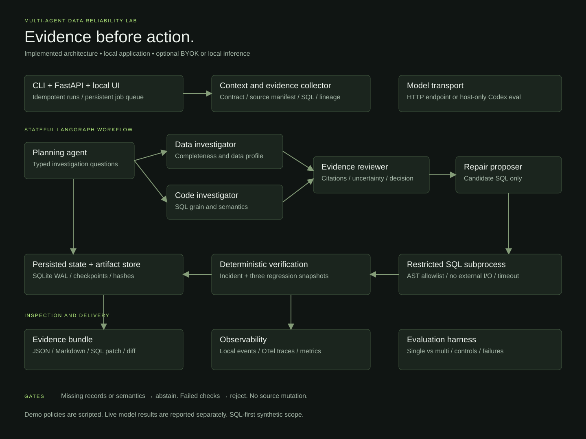
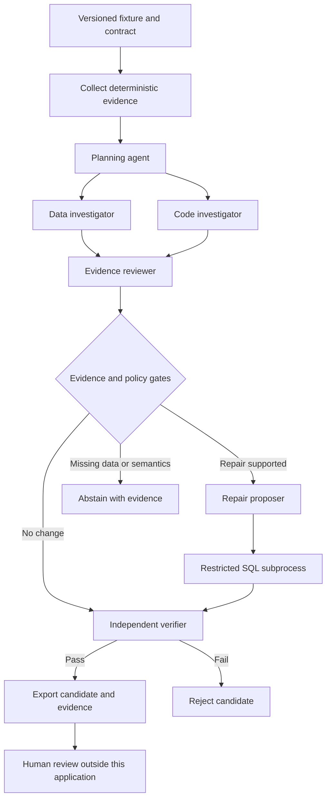
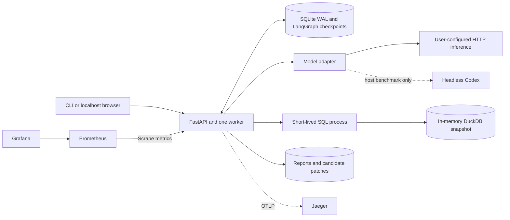

# Architecture and operating boundaries

The lab investigates SQL incidents in a synthetic commerce dataset. It runs locally, saves each investigation, and exports proposed repairs. Support for importing dbt projects is planned.

## **Agent workflow**

The multi-agent topology uses separate reasoning contexts and a LangGraph fan-out/fan-in barrier. A single-agent baseline sees the same full evidence bundle. Roles are not separate model weights or containers.

Agents in this release reason over a bounded evidence bundle; they do not freely browse repositories or select arbitrary tools. Deterministic code collects the observations. The model proposes SQL, while execution and verification remain code-controlled.

## **Deployment**

The Compose observability profile provisions Jaeger, Prometheus, and Grafana. Local persisted events always work without those services. Set the OTLP endpoint when enabling the profile. Jaeger uses ephemeral trace storage in this development profile; local run events and checkpoints persist in the application volume.

## **State, recovery, and idempotency**

API idempotency keys bind to request hashes; reuse with a different request is a conflict. A single worker atomically claims a queued run. Startup requeues interrupted jobs. LangGraph reloads their checkpoints. Parsed model outputs are cached by role/context/schema/model/transport; model-call reservations persist across restart. A crash after a provider request but before cache commit may consume another call on retry; exactly-once external inference is not promised.

Artifact writes use temporary files followed by replacement. Completed runs return their existing result. The API is intended for one process / one Uvicorn worker. Horizontal scaling, distributed leases, cancellation, and multi-user auth are future work.

## **Agent contracts**

| Role | Output | Boundary |
|---|---|---|
| Planner | Objective, data question, code question | No executor access |
| Data investigator | Cause hypothesis and evidence IDs | Profile, source manifest, contract, current result |
| Code investigator | Cause hypothesis and evidence IDs | SQL, lineage, profile, contract |
| Reviewer | Repair / no-change / abstain | Must cite existing evidence IDs |
| Repair proposer | One candidate SELECT and rationale | Only orders/refunds tables and allowed functions |
| Deterministic verifier | Pass/fail checks | Independent Python oracle; no LLM judge |

Evidence citation existence is enforced; semantic support is not proven automatically. Live benchmarks report wrong diagnoses even when a conservative gate prevents a repair.

## **Execution boundary**

SQLGlot validates a single SELECT with approved tables and functions. DuckDB external access is disabled. Each query executes in a new process with a deadline, bounded result rows, one DuckDB thread, and a DuckDB memory cap. The child receives no provider credentials.

This is defense in depth for a local synthetic laboratory, not a hardened arbitrary-code sandbox. DuckDB's memory cap is not an OS process-memory limit. Compose adds service memory/CPU/PID limits, a read-only root filesystem, dropped capabilities, and a writable data volume. There is no Docker socket mount and no generated Python execution.

## **Design decisions**

- SQLite instead of Postgres: one-machine reproducibility and fewer mandatory services. Preserve Store boundaries for a later backend.
- SQL-first instead of arbitrary Python: testable execution surface with a conservative allowlist.
- One proposed repair instead of unbounded self-correction: failures remain inspectable; model schema retries are bounded.
- Explicit demo mode: scripted fixture policies are never presented as live model reasoning.
- No hosted dependency: the default demo needs no key; users choose external or local inference for live runs.

